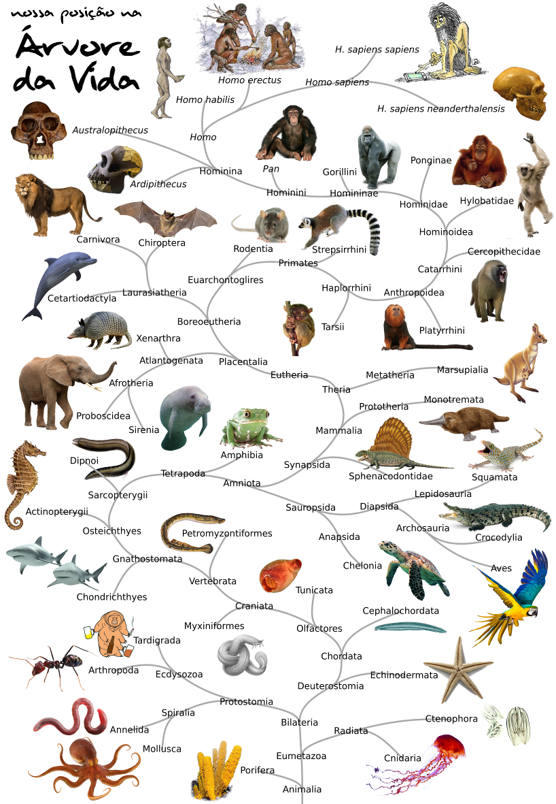
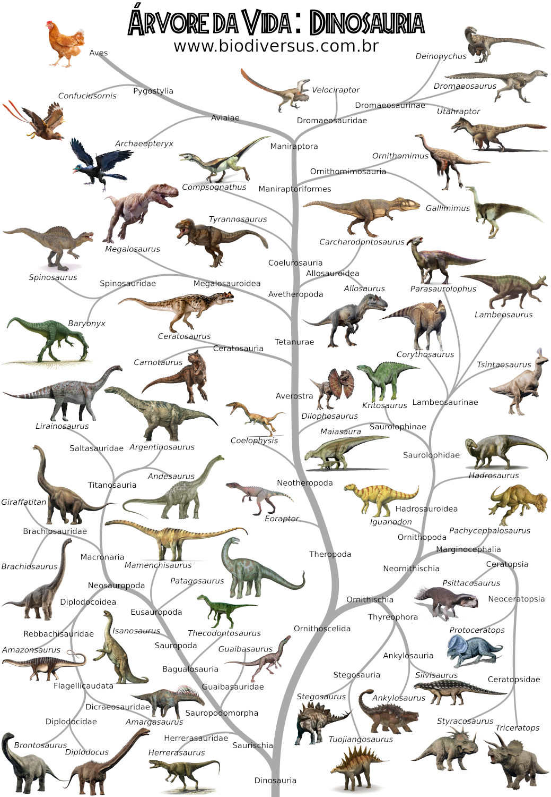
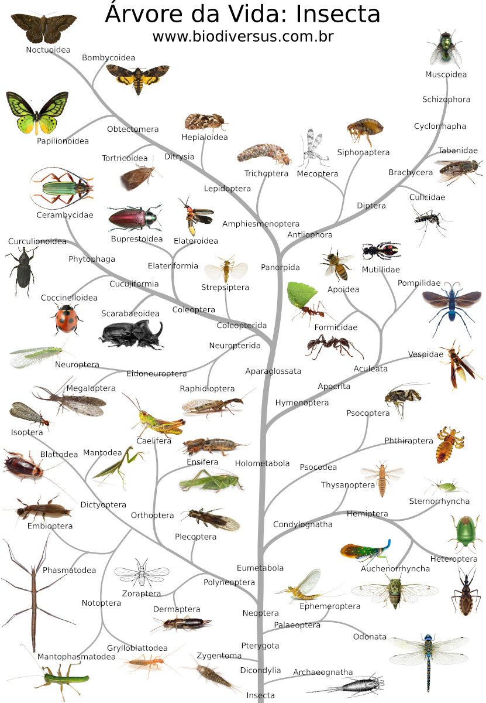

# arvorizar

### Criar árvores filogenéticas ilustradas

Este programa ajuda a desenhar árvores filogenéticas (também chamadas árvores evolutivas ou cladogramas) num formato mais artístico, diferente das árvores retas, triangulares ou circulares criadas pela maioria dos programas disponíveis no mercado.

Cada nó na árvore corresponde a uma espécie ou clado (grupos de espécies aparentadas), e pode ter uma ou mais figuras associadas. A estrutura da árvore e as imagens são salvas no LocalStorage do navegador (por isso recomenda-se o Firefox, onde o limite de 5 MB pode ser expandido, o que costuma ser necessário para árvores grandes).

O arquivo .html pode ser salvo, e o trabalho pode ser feito inteiramente offline (lembre-se de salvar também o arquivo de ajuda, neste caso).

### Lembrete importante

Uma árvore filogenética é uma **hipótese** sobre a evolução de determinado grupo de organismos. Não existem _verdades absolutas_ na ciência.

## Exemplos de árvores

### Nossa posição na Árvore da Vida

### Dinosauria - a árvore dos dinossauros (incluindo aves)

### Insecta - a árvore dos insetos

